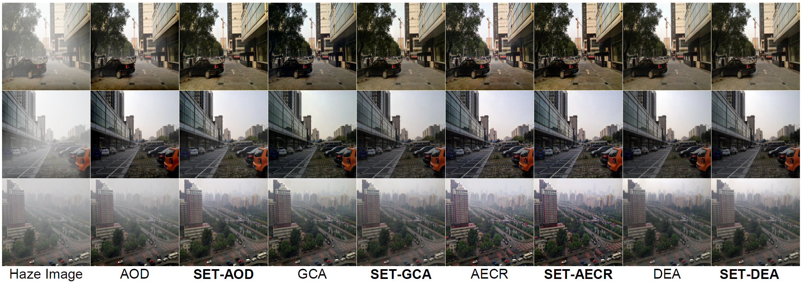

<div align="center"> 

<h2> 
Spectral Enhanced Tuning: An Efficient Plug-and-Play Framework for Frequency-Aware Dehazing
</h2>


[Cheng Tang]() et al.


University of Science and Technology of China


</div>


This repository is the official implementation of "Spectral Enhanced Tuning: An Efficient Plug-and-Play Framework for Frequency-Aware Dehazing". **More information will be fully disclosed upon the acceptance of the paper.**

[1. Overall Architecture](#overall-architecture)      [2. Getting Started](#getting-started)         [3. Results](#improvement-effect-results-of-other-model)         

## News
We are sorry, there is nothing for the time being :-)

## Overall Architecture


## Getting Started

### Environment

1. Clone this repo:

```
git clone https://github.com/USTC-T/SETuning.git
```

2. Create a new conda environment and install dependencies:

```
conda create -n pytorch_1_10 python=3.8
conda activate pytorch_1_10
conda install pytorch==1.10.0 torchvision==0.11.0 torchaudio==0.10.0 cudatoolkit=11.3 -c pytorch -c conda-forge
pip install opencv-python
pip install scikit-image
pip install scipy
pip install timm
pip install einops
```
When evaluating on OTS with jpeg images as input, please make sure that the version of pillow is 8.3.2, this is to ensure that the same decoding algorithm is used for jpeg images during evaluation and training.
### Data Preparation

1. Download the dataset: [[RESIDE](https://sites.google.com/view/reside-dehaze-datasets/reside-v0)] and [[HAZE4K](https://github.com/liuye123321/DMT-Net)] and [[SOTS](https://hyper.ai/datasets/18179)] and [[NH-HAZE](https://data.vision.ee.ethz.ch/cvl/ntire20/nh-haze/)].

2. Make sure the file structure is consistent with the following:
**keep the same name in clear and hazy**
```
dataset/
├── HAZE4K
│   ├── test
│   |   ├── clear
│   |   │   ├── 1.png
│   |   │   └── 2.png
│   |   │   └── ...
│   |   └── hazy
│   |       ├── 1.png
│   |       └── 2.png
│   |       └── ...
│   └── train
│       ├── clear
│       │   ├── 1.png
│       │   └── 2.png
│       │   └── ...
│       └── hazy
│           ├── 1.png
│           └── 2.png
│           └── ...
...
```

### Training
```
nohup bash -c 'export CUDA_VISIBLE_DEVICES=1;  anaconda3/envs/py3_10/bin/python SET_YourModelName_train.py --epochs 4000 --iters_per_epoch 500 --finer_eval_step 1400000 --w_loss_L1 1.0 --w_loss_CR 0.1 --start_lr 0.0001 --end_lr 0.000001 --exp_dir ../exps/ModelName/path --model_name your_model_name --dataset outdoor' > ModelName_DatasetName.log 2>&1 &
```

### Evaluation
1. Download the pre-trained models on [Will Update soon.]()
2. Use [eval.py](code/eval.py)


## Improvement effect Results of other model 





